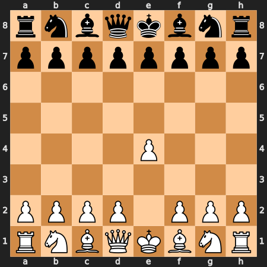

  

---

<!-- INTERACTIVE GAMES (CHESS & TIC-TAC-TOE) -->

<h3 align="center">🎮 Interactive Games</h3>

<i>Play or smth idk</i>

<h4 align="center">♟️ Chess</h4>

<i>You can play</i>

  

  <b>How 2 Play</b> 
  • <a href="https://github.com/Hahaha13561/Hahaha13561/issues/new?title=chess%7Cmove%3Ae2e4&body=Hamle%3A+e2e4"><b>You can click here to do e2e4</b></a>. 
  • Or open a new Issue and write your move: <code>chess|move:e2e4</code> (or any else move)  

---

<h4 align="center">❌ Tic-Tac-Toe ⭕</h4>

<i> X is you, O is bot.</i>

  

<table align="center">
  <tr>
    <td align="center"><a href="https://github.com/Hahaha13561/Hahaha13561/issues/new?title=ttt%7Cmove%3A1&body=Hamle%3A+1"><b>[ 1 ]</b></a></td>
    <td align="center"><a href="https://github.com/Hahaha13561/Hahaha13561/issues/new?title=ttt%7Cmove%3A2&body=Hamle%3A+2"><b>[ 2 ]</b></a></td>
    <td align="center"><a href="https://github.com/Hahaha13561/Hahaha13561/issues/new?title=ttt%7Cmove%3A3&body=Hamle%3A+3"><b>[ 3 ]</b></a></td>
  </tr>
  <tr>
    <td align="center"><a href="https://github.com/Hahaha13561/Hahaha13561/issues/new?title=ttt%7Cmove%3A4&body=Hamle%3A+4"><b>[ 4 ]</b></a></td>
    <td align="center"><a href="https://github.com/Hahaha13561/Hahaha13561/issues/new?title=ttt%7Cmove%3A5&body=Hamle%3A+5"><b>[ 5 ]</b></a></td>
    <td align="center"><a href="https://github.com/Hahaha13561/Hahaha13561/issues/new?title=ttt%7Cmove%3A6&body=Hamle%3A+6"><b>[ 6 ]</b></a></td>
  </tr>
  <tr>
    <td align="center"><a href="https://github.com/Hahaha13561/Hahaha13561/issues/new?title=ttt%7Cmove%3A7&body=Hamle%3A+7"><b>[ 7 ]</b></a></td>
    <td align="center"><a href="https://github.com/Hahaha13561/Hahaha13561/issues/new?title=ttt%7Cmove%3A8&body=Hamle%3A+8"><b>[ 8 ]</b></a></td>
    <td align="center"><a href="https://github.com/Hahaha13561/Hahaha13561/issues/new?title=ttt%7Cmove%3A9&body=Hamle%3A+9"><b>[ 9 ]</b></a></td>
  </tr>
</table>

---

<h3 align="center">GitHub Stats</h3>

  
  

  

---

<h3 align="center">🌐 Socials</h3>

  
  
  
  
  
  
  
  
  
  
  
  

---
<h3 align="center">Activity Overview</h3>

  

---
<h3 align="center">About Me</h3>

  Mostly into low-level systems, compiler development and reverse engineering. Trying to understand how computers actually work. Linux enthusiast, inspired by Torvalds and Davis. Been using Git and GitHub a while, only recently started using it properly.

 

### Hot Takes
* **Into:** C, Rust, Python, JavaScript, Linux.
* **Hard Pass:** Java & Oracle (pure hate), C# (nostalgic memories, but mostly annoys me).
* **Meh:** C++ (it exists, just not really my thing).

 

### Projects
* 🛠️ **Wrench** *(Ongoing)* — A custom programming language compiler written from scratch. Major release in progress.
* 🌀 **HairOS** *(Inactive, to be reformatten in future)* — The old version was just a Linux spin with some CSS tweaks (nothing impressive). The goal is to turn this into an actual custom kernel/OS from scratch in the future.
* 🛰️ **ROTAM** *(Inactive)* — Tracking app project, it didn't pass the competition phase.
* 📦 **OKO83 / MATCAP / Matçap** *(Archived / Cancelled)* — Old experiments, now buried or private.
* 🤝 **Contributions** — Contributed to `simpaudio`. I like jumping into random repos when I'm bored and tweaking code.

 

## Open to Help & Collaboration
You need a hand with a project, feel free to reach out. I like solving random code problems in random repositories when I've got spare time.

---

### Phrase of the Day
<!-- QUOTE:START -->
> *"No."*
<!-- QUOTE:END -->